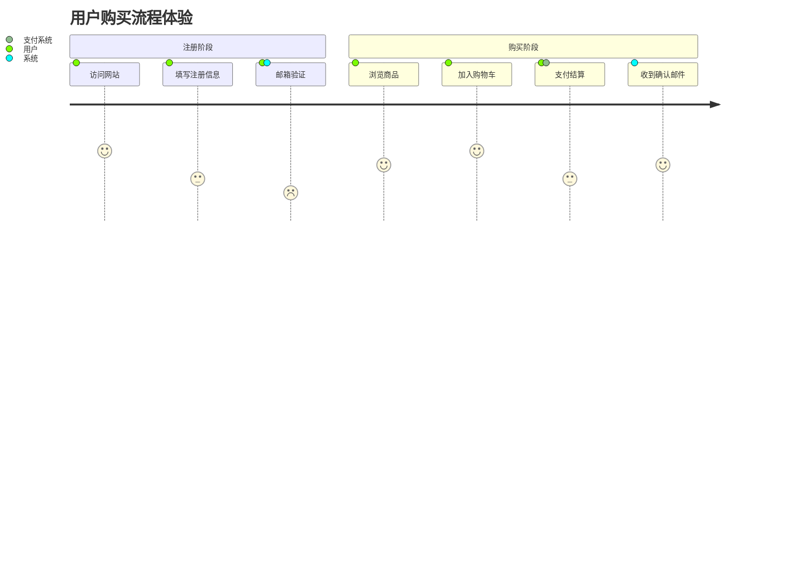

# LumenMark v0.3.11 Theme QA Sample

This document is used to verify that every official and imported theme keeps the app readable.

## Links And Inline Content

Open [LumenMark Releases](https://github.com/zuxingyu/LumenMark/releases) and verify that the link tooltip/popover text is readable.

Inline code `const readable = true`, **bold text**, *italic text*, ~~deleted text~~, ^superscript^, ~subscript~, and <u>underline</u>.

## Lists

- Workspace text must remain readable.
- Outline text must remain readable.
- Search fields must remain readable.

1. Official themes are not deletable.
2. Imported themes can be previewed, applied, and deleted.

## Table

| Surface | Expected |
| --- | --- |
| Sidebar | Text contrast is readable |
| Code block | Background follows the theme |
| Diagram canvas | Lines remain visible |

## Mermaid Journey



## LaTeX

$$
e^{i\theta} = \cos \theta + i\sin \theta
$$

## Code

```bash
#!/bin/bash
echo "current: $(pwd)"
for file in *.md; do
  echo "process: $file" # comment must be visible
done
```

## Image


