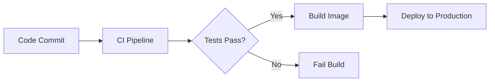

# Service Deployment Notes

This sample confirms the primary LumenMark preview path: GitHub-flavored Markdown, formulas, diagrams, and exportable code.

## Capacity Planning

For request throughput we use:

$$
L = \lambda W
$$

| Environment | Target | Ready |
| --- | ---: | --- |
| Staging | 2 replicas | Yes |
| Production | 6 replicas | Pending |

## Deployment Flow



## Configuration

```json file=service.json
{
  "name": "lumen-api",
  "replicas": 6
}
```

```sql file=healthcheck.sql
select service, status
from deployments
where environment = 'production';
```

## Scripts

```shell file=verify.sh
#!/usr/bin/env sh
curl --fail https://service.example.test/health
```

```python file=deploy.py
import subprocess

def deploy(environment: str) -> None:
    subprocess.run(["deploy", environment], check=True)
```

```java file=HealthCheck.java
public final class HealthCheck {
  public boolean ready() {
    return true;
  }
}
```

